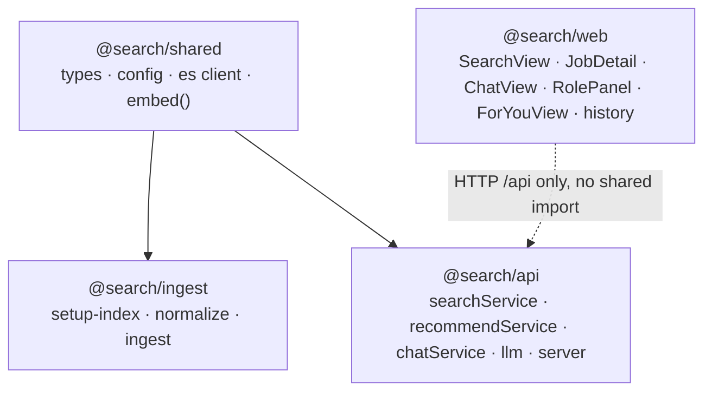
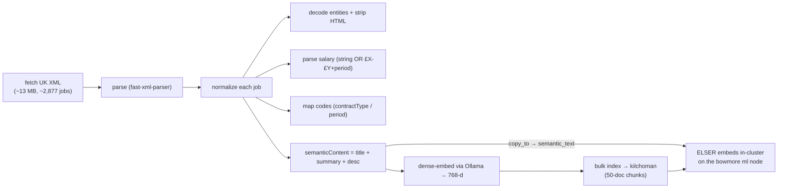
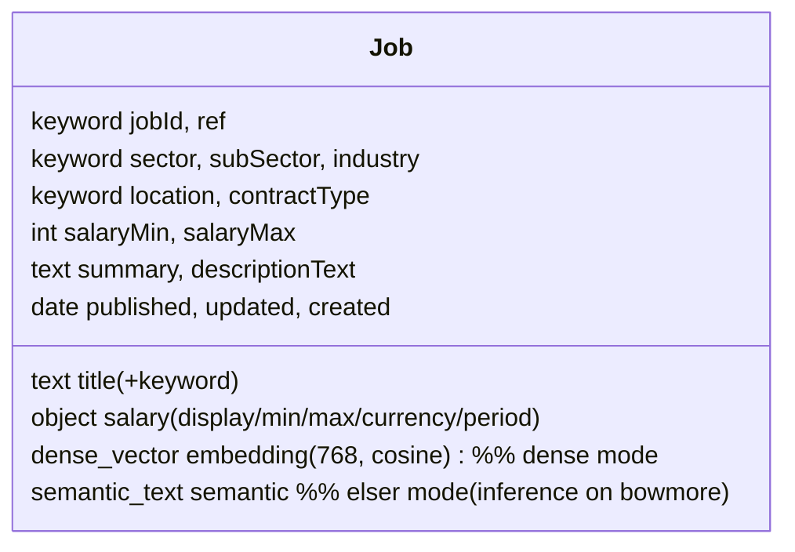
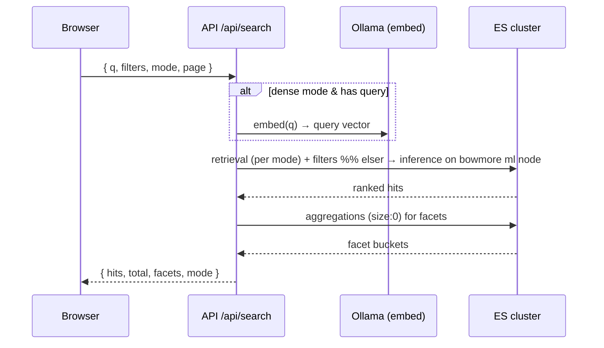
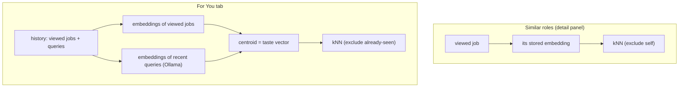
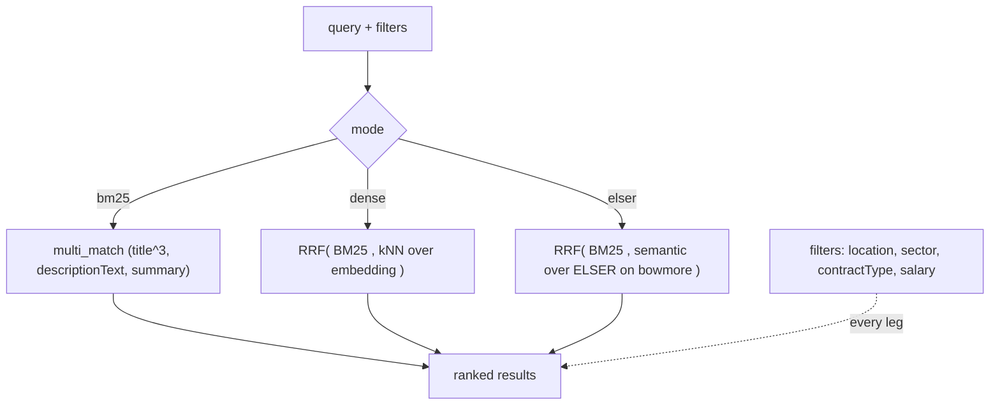
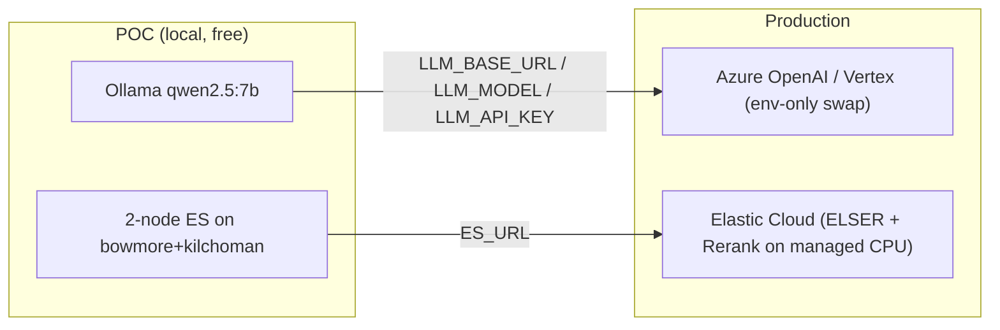

# Architecture

A job-search POC over the real Michael Page UK feed, with classic faceted search, conversational
(ChatGPT-like) search, and content-based recommendations. Everything runs locally and free across
two LAN machines that form one Elasticsearch cluster.

- **kilchoman** — `192.168.68.56`, small home server (2013 CPU, no AVX2). ES **master + data** node.
- **bowmore** — `192.168.68.51`, laptop (16 GB, AVX2). Runs the API, the web app, **Ollama**, and an
  ES **ml-only node** that runs **ELSER** (its CPU has the AVX2 that ELSER's libtorch needs; kilchoman's doesn't).

No Claude/Anthropic at runtime. The LLM is local (Ollama), behind a provider-agnostic
OpenAI-compatible client so it can be swapped for Azure OpenAI / Vertex in production by env alone.

## 1. Deployment topology (2-node ES cluster)

```mermaid
flowchart LR
  subgraph bowmore["bowmore — laptop (16GB, AVX2)"]
    web["Web (Vite + React)\n:5173"]
    api["API (Fastify)\n:3001"]
    subgraph ollama["Ollama :11434"]
      chat["qwen2.5:7b (chat+tools)"]
      embed["nomic-embed-text (768-d)"]
    end
    esml["ES ml-node 'bowmore'\nroles: ml\nruns ELSER"]
    web -->|/api proxy| api
    api -->|chat / embeddings| ollama
  end

  subgraph kilchoman["kilchoman — 192.168.68.56 (no AVX2)"]
    esdata["ES master+data 'kilchoman'\nroles: master,data,ingest,transform\nindex: jobs"]
  end

  api -->|HTTP :9200| esdata
  esdata <-->|cluster transport :9300\n(mp-search)| esml
  esdata -.->|ELSER inference dispatched to ml node| esml
```

The API only talks to kilchoman's `:9200`. When a `semantic`/ELSER operation runs, the cluster
dispatches the PyTorch inference to the `ml` node on bowmore automatically.

## 2. Monorepo layout



## 3. Ingest pipeline (one-off)



Dense vectors are computed on bowmore (Ollama) and shipped as plain numbers. ELSER vectors are
produced in-cluster on the bowmore ml node at index time. Small bulk chunks keep each
ELSER-embedding request under the client timeout.

## 4. Data model (the `jobs` index)



## 5. Classic search flow



`GET /api/modes` reports which modes the index supports (dense if `embedding` present, elser if
`semantic` present); the UI disables unavailable ones.

## 6. Conversational (RAG + tool-calling) flow

```mermaid
sequenceDiagram
  participant U as Browser (SSE)
  participant API as API /api/chat
  participant LLM as Ollama qwen2.5:7b
  participant S as searchService
  participant ES as ES cluster

  U->>API: { sessionId, message }
  API->>LLM: history + system prompt + search_jobs tool (stream)
  alt model calls the tool
    LLM-->>API: tool_call search_jobs(args)
    API-->>U: SSE jobs → "Matching roles" side panel
    API->>S: search(args)
    S->>ES: hybrid retrieval
    ES-->>API: hits → fed back to the model
  end
  LLM-->>API: grounded answer tokens
  API-->>U: SSE tokens → answer leads the thread; jobs stay in the side panel
```

Up to 3 tool rounds; per-session history in an in-memory Map (POC). The answer leads the chat
thread; surfaced jobs render in a separate side panel, not inline.

## 7. Recommendations (content-based, kNN on dense vectors)



History (viewed job ids + queries) is tracked client-side in `localStorage`.

## 8. Retrieval modes



## 9. Local → production swap



The LLM client is OpenAI-compatible and provider config is env-driven, so moving to a hosted model
or managed Elasticsearch (where ELSER runs without the AVX2 constraint) is configuration, not code.
