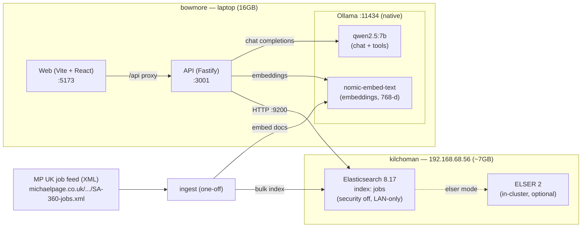
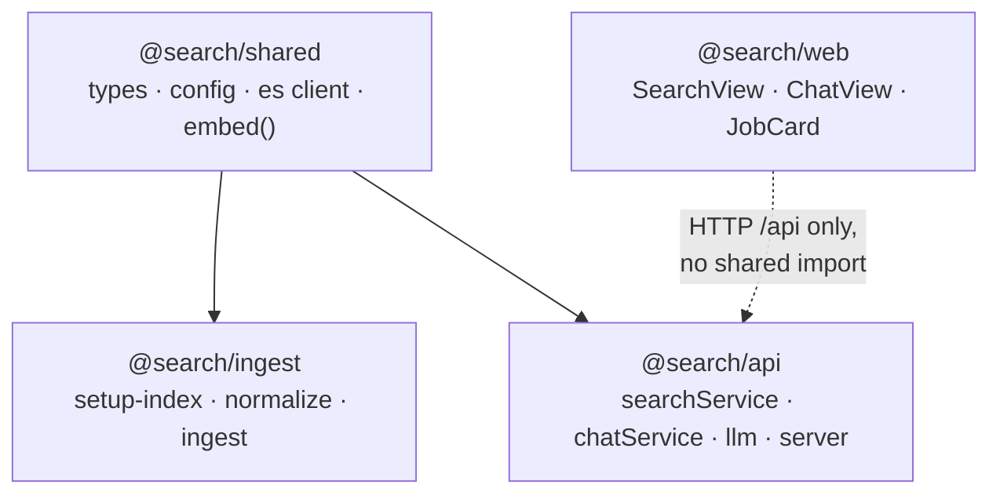
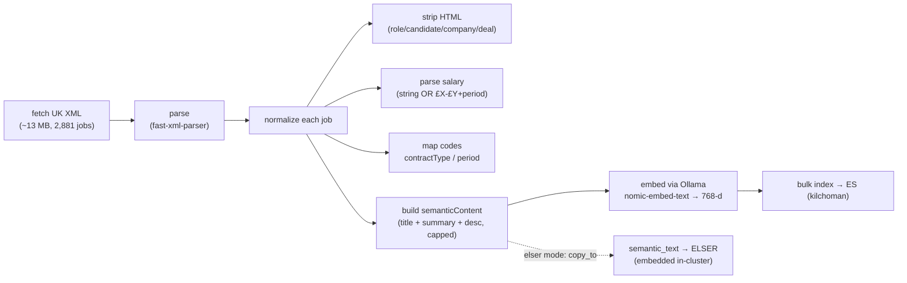
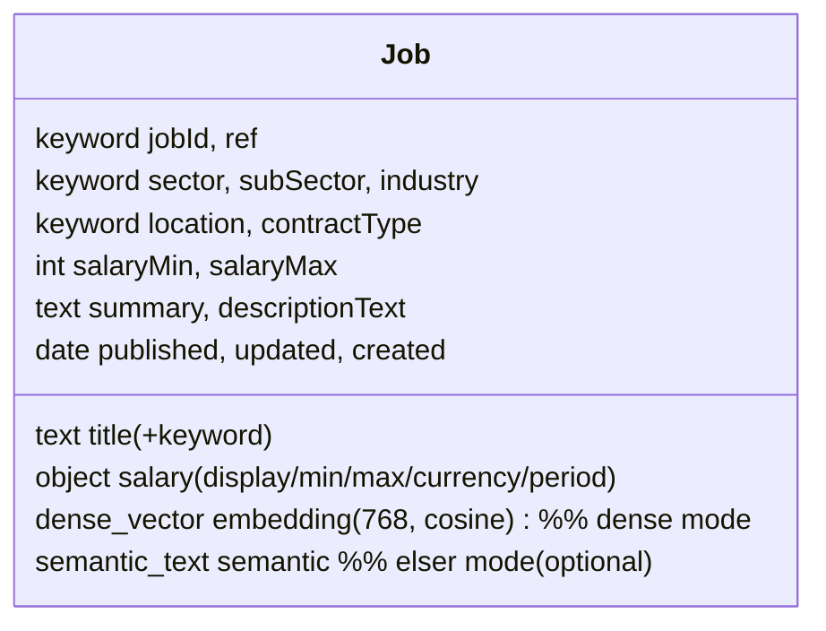
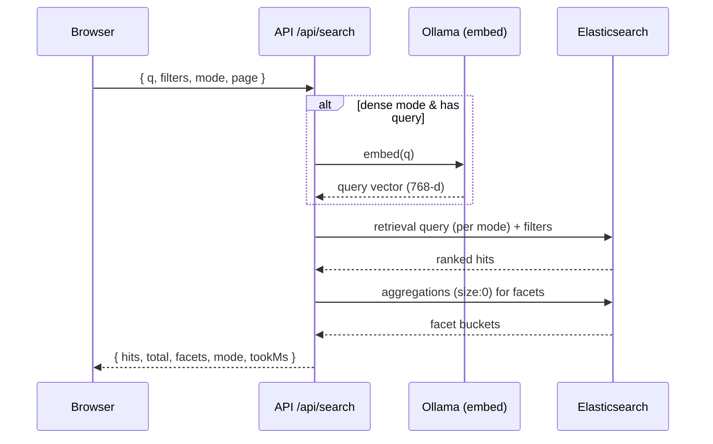
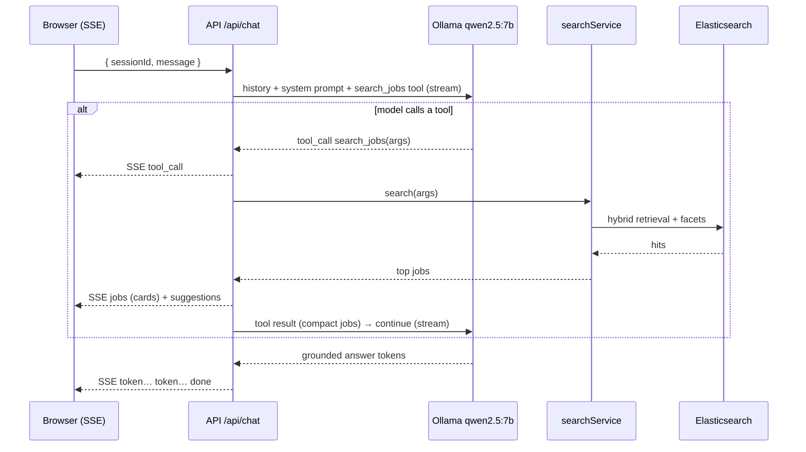
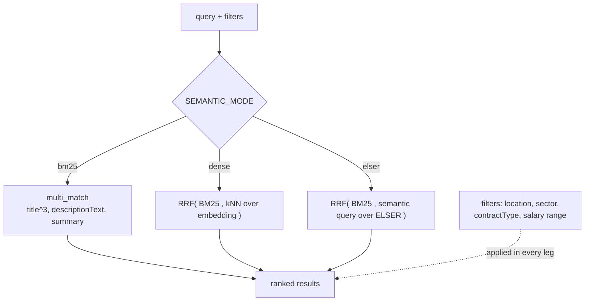
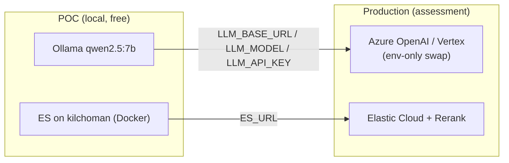

# Architecture

A job-search POC over the real Michael Page UK feed, with a classic faceted search and a
conversational (ChatGPT-like) search. Everything runs locally and free across two LAN machines.

- **bowmore** — dev laptop (16 GB). Runs the API, the web app, and **all model inference** (Ollama).
- **kilchoman** — `192.168.68.56`, small home server (~7 GB, old CPU, no usable GPU). Runs
  **Elasticsearch only** as a storage + search node.

No Claude/Anthropic at runtime. The LLM is local (Ollama), behind a provider-agnostic
OpenAI-compatible client so it can be swapped for Azure OpenAI / Vertex in production by env alone.

## 1. Deployment topology

## 2. Monorepo layout

`web` deliberately does **not** import `@search/shared` (which depends on the ES client / Node
APIs) — it keeps its own light type mirror so the browser bundle stays clean.

## 3. Ingest pipeline (one-off)

Embeddings are computed on bowmore (fast box) and shipped to kilchoman as plain vectors; kilchoman
only stores and searches them. ELSER, when enabled, embeds in-cluster on kilchoman instead.

## 4. Data model (the `jobs` index)

One index serves all three retrieval modes; `dense`/`elser` fields coexist so modes are comparable
without re-ingesting.

## 5. Classic search flow

Facets come from a **separate** `size:0` aggregation query so counts are correct regardless of the
ranked retrieval mode (kNN/RRF top-k would otherwise skew them).

## 6. Conversational (RAG + tool-calling) flow

The loop runs up to 3 tool rounds. Per-session history is kept in an in-memory `Map` (POC only).
The LLM is instructed to ground every claim in tool results and cite jobs by title + ref.

## 7. Retrieval modes

- **bm25** — keyword baseline (also used for empty-query browse and date sort).
- **dense** — reliable semantic default; query embedded on bowmore, fused with BM25 via RRF.
- **elser** — Elastic-native sparse semantic; runs in-cluster on kilchoman. May be slow / fail to
  deploy on the old CPU — an expected finding documented in `ASSESSMENT.md`.

## 8. Local → production swap

Because the LLM client is OpenAI-compatible and provider config is env-driven, moving to a hosted
model or managed Elasticsearch is a configuration change, not a code change.
